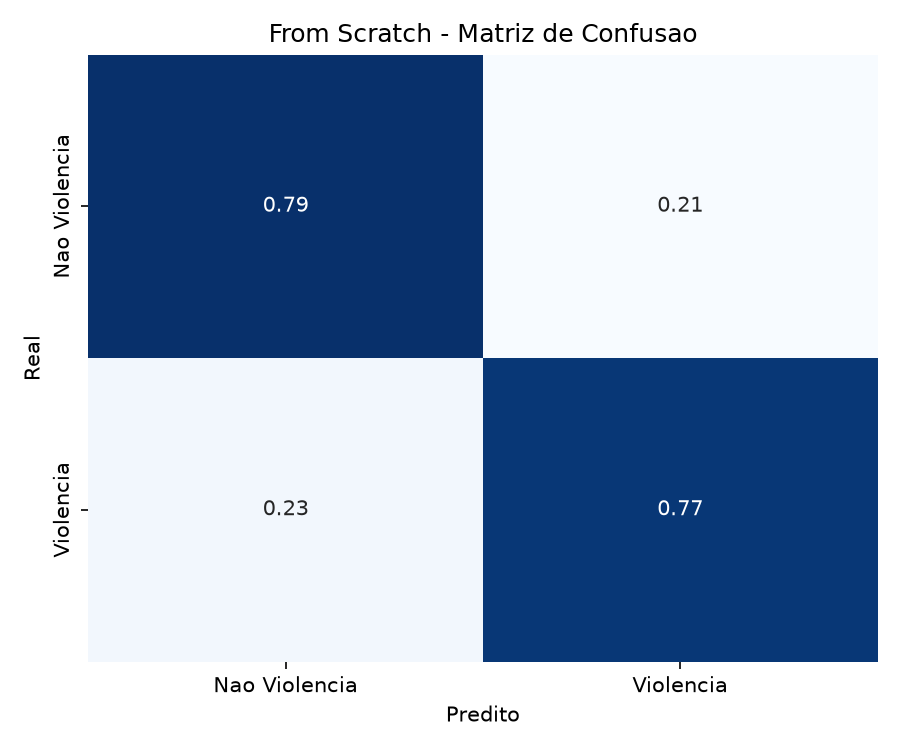
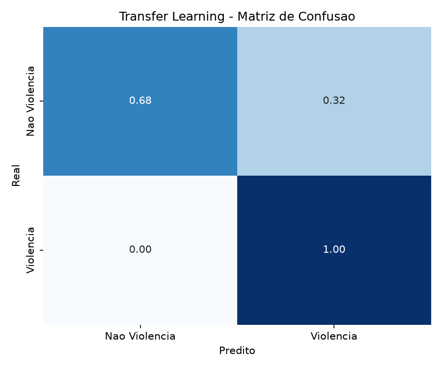
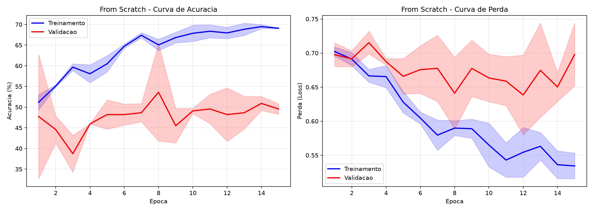
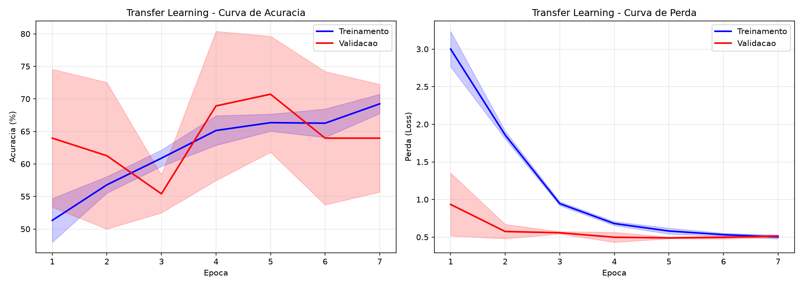

# Classificação de Violência contra a Mulher em Imagens

Comparação entre AlexNet treinada do zero e Transfer Learning (VGG16) para detecção binária de violência em imagens.

> [!WARNING]
> Dataset não incluído. Você precisará do seu próprio conjunto de imagens organizado em `mulheres/casal/` e `mulheres/violencia/`.

> [!WARNING]
> Modelos de Transfer Learning não incluídos. `extrator_vgg16.keras` (56 MB) e `classificador_transfer.keras` (149 MB) ultrapassam o limite do GitHub. Apenas `modelo_from_scratch.keras` (35 MB) está disponível. Execute `python transfer_only.py` para treinar o Transfer Learning localmente.

**Disciplina:** Visão Computacional — CEFET-MG  
**Autor:** Igor Moreira Lopes  
**Julho de 2026**

---

## Sumário

1. [Descrição do Problema](#descrição-do-problema)
2. [Dataset](#dataset)
3. [Pré-processamento](#pré-processamento)
4. [Arquiteturas](#arquiteturas)
5. [Experimentos](#experimentos)
6. [Resultados](#resultados)
7. [Estrutura do Projeto](#estrutura-do-projeto)
8. [Instalação e Dependências](#instalação-e-dependências)
9. [Como Executar](#como-executar)
10. [Classificação de Novas Imagens](#classificação-de-novas-imagens)
11. [Documentos Gerados](#documentos-gerados)

---

## Descrição do Problema

Classificação binária de imagens em duas classes:
- **Casal (classe 0):** interação normal entre duas pessoas
- **Violência (classe 1):** indícios de agressão física

Duas abordagens de CNN foram comparadas:
1. **AlexNet treinada do zero** — pesos aleatórios, treinada apenas com o dataset do projeto
2. **Transfer Learning com VGG16** — extrator de features pré-treinado na ImageNet + classificador treinado

---

## Dataset

- **Total:** 204 imagens
  - 96 imagens de casal (interação normal)
  - 108 imagens de violência
- Fontes diversas (ângulos, iluminações, contextos variados)
- Imagens livres de direitos autorais

---

## Pré-processamento

Aplicado a todas as imagens:
1. **Redimensionamento** para 224×224 pixels (RGB)
2. **Anonimização** com filtro Gaussiano 5×5 (desfoque facial e corporal)
3. **Normalização** dividindo cada pixel por 255 (intervalo [0, 1])

### Pipeline de prevenção de Data Leakage

```
Dataset (204 imagens)
    │
    ├── Particionamento estratificado 80/20
    │
    ├── Treino (163 imagens)
    │     └── Data augmentation (rotação ±15°, deslocamento 10%,
    │           espelhamento, brilho 0.8–1.2, zoom 10%)
    │           └── 489 imagens de treino
    │
    └── Teste (41 imagens) — intacto (sem augmentation)
```

O particionamento estratificado mantém a mesma proporção de classes no treino e no teste.

### Data Augmentation

Aplicado **apenas** no conjunto de treino, com:
- Rotação de até ±15°
- Deslocamento horizontal e vertical de até 10%
- Espelhamento horizontal
- Variação de brilho entre 0.8 e 1.2
- Zoom de até 10%

Isso expandiu o treino de 163 para 489 imagens.

---

## Arquiteturas

### AlexNet (From Scratch)

Adaptada para rodar em CPU com dataset reduzido:

| Camada          | Filtros Original | Filtros Adaptada |
|-----------------|------------------|------------------|
| Conv1           | 96×11×11, s4     | 32×11×11, s4     |
| Conv2           | 256×5×5, s1      | 64×5×5, s1       |
| Conv3           | 384×3×3, s1      | 128×3×3, s1      |
| Conv4           | 384×3×3, s1      | 128×3×3, s1      |
| Conv5           | 256×3×3, s1      | 64×3×3, s1       |
| **Dense**       | 4096 → 4096      | 1024 → 1024      |
| Dropout         | 0.5              | 0.5              |

MaxPooling 3×3 com stride 2 após Conv1, Conv2 e Conv5.

### Transfer Learning (VGG16 + Classificador)

**Etapa 1 — Extração de features:**
- VGG16 com pesos ImageNet, topo removido (include_top=False)
- Todas as camadas congeladas (trainable = False)
- Cada imagem 224×224 → vetor de 25088 dimensões

**Etapa 2 — Classificador treinado:**
```
Input(25088) → Dense(512, ReLU) → Dropout(0.5) →
Dense(256, ReLU) → Dropout(0.5) → Dense(2, Softmax)
```

---

## Experimentos

### Configuração

| Parâmetro           | From Scratch | Transfer Learning |
|---------------------|--------------|-------------------|
| Arquitetura         | AlexNet adaptada | VGG16 + Classificador |
| Execuções           | 3            | 3                 |
| Épocas máximas      | 25           | 30                |
| Otimizador          | Adam (lr=0.001) | Adam (lr=0.001) |
| Loss                | Sparse Categorical Crossentropy | Sparse Categorical Crossentropy |
| Early Stopping      | Paciência 10 | Paciência 5       |
| Validação           | 15% do treino | 15% do treino     |
| Hardware            | CPU (sem GPU) | CPU (sem GPU)     |

### Otimizador: Adam

O Adam (Adaptive Moment Estimation) ajusta a taxa de aprendizado individualmente para cada peso do modelo. Ele combina:
- **Momentum:** acelera a convergência na direção correta
- **RMSProp:** adapta a taxa de aprendizado por parâmetro

Isso permite convergência mais rápida e estável comparado ao SGD clássico, especialmente em problemas com dados limitados.

### Loss: Sparse Categorical Crossentropy

Função que mede o erro entre a probabilidade prevista pelo modelo e o rótulo real.

$$Loss = -\sum_{i=1}^{C} y_i \log(\hat{y}_i)$$

Onde $y_i$ é o rótulo verdadeiro (one-hot implícito) e $\hat{y}_i$ é a probabilidade prevista. Quanto menor a loss, melhor o modelo.

### Early Stopping

Técnica que monitora a loss de validação e interrompe o treino automaticamente quando ela para de melhorar por N épocas consecutivas (paciência). Os melhores pesos são restaurados automaticamente. Benefícios:
- Evita overfitting
- Economiza tempo de processamento
- Não requer ajuste manual do número exato de épocas

---

## Resultados

### Métricas Comparativas (média de 3 execuções)

| Métrica             | From Scratch      | Transfer Learning |
|---------------------|-------------------|-------------------|
| Acurácia            | 75,61% ± 5,27%   | **85,37% ± 3,45%** |
| Precisão            | 81,26% ± 10,33%  | 80,16% ± 3,58%   |
| Recall              | 74,24% ± 5,67%   | **96,97% ± 4,29%** |
| F1-Score            | 76,80% ± 2,67%   | **87,68% ± 2,86%** |

### Matrizes de Confusão





### Análise

- **Transfer Learning superior em todas as métricas**, especialmente Recall (97% vs 74%)
- **Recall de 97%:** praticamente todas as imagens de violência foram detectadas corretamente. Para este problema, falso negativo (violência não detectada) é muito mais grave que falso positivo (alarme falso)
- **From Scratch limitado pelo dataset pequeno (204 imagens)** — CNN precisa de milhares de exemplos para aprender features do zero
- **VGG16 pré-treinada na ImageNet (~14M imagens)** já possui representações robustas de bordas, texturas e formas

### Curvas de Aprendizado





---

## Estrutura do Projeto

```
Seminário 2/
├── artigo.tex              →  artigo.pdf        (2 páginas, twocolumn LaTeX)
├── slides.tex              →  slides.pdf         (18 slides, Beamer Madrid)
├── guia_apresentacao.md                          (guia técnico do código)
├── roteiro_apresentacao.md                       (roteiro slide a slide)
├── README.md                                     (esta documentação)
├── mulheres/                                     (dataset)
│   ├── casal/               (96 imagens)
│   └── violencia/           (108 imagens)
└── src/
    ├── .venv/                                    (ambiente virtual Python)
    ├── config.py                                 (constantes e paths)
    ├── preprocess.py                             (carregamento, anonimização, split, augmentation)
    ├── alexnet.py                                (AlexNet scratch + VGG16 extrator + classificador)
    ├── main.py                                   (Experimento A: AlexNet do zero)
    ├── transfer_only.py                          (Experimento B: Transfer Learning)
    ├── evaluate.py                               (plotagem + métricas + matriz de confusão)
    ├── predict.py                                (classificador de imagens individuais)
    └── resultados/
        ├── from_scratch_metricas.txt             (métricas detalhadas)
        ├── transfer_learning_metricas.txt        (métricas detalhadas)
        ├── modelo_from_scratch.keras             (35 MB)
        ├── extrator_vgg16.keras                  (57 MB)
        ├── classificador_transfer.keras          (149 MB)
        └── graficos/
            ├── from_scratch_learning_curves.png
            ├── from_scratch_confusion_matrix.png
            ├── transfer_learning_learning_curves.png
            └── transfer_learning_confusion_matrix.png
```

### Descrição dos Módulos

| Arquivo | Função |
|---------|--------|
| `config.py` | Define constantes: paths, IMG_SIZE=224, BATCH_SIZE=16, EPOCHS=25, NUM_RUNS=3, classes |
| `preprocess.py` | Carrega dataset do disco, aplica Gaussian Blur, redimensiona, normaliza, faz split estratificado e data augmentation |
| `alexnet.py` | Constrói modelo AlexNet adaptado (from scratch), VGG16 feature extractor (congelado), e classificador denso para transfer learning |
| `main.py` | Executa Experiment A: treina AlexNet do zero em 3 runs, salva métricas, gráficos e modelo |
| `transfer_only.py` | Executa Experiment B: extrai features com VGG16, treina classificador em 3 runs, salva métricas, gráficos e modelos |
| `evaluate.py` | Funções de plotagem (curvas de aprendizado, matriz de confusão), cálculo e salvamento de métricas |
| `predict.py` | Script para classificar uma imagem individual usando modelo salvo |

---

## Instalação e Dependências

### Ambiente Virtual

```bash
cd src/
python3 -m venv .venv
source .venv/bin/activate
```

### Dependências

```bash
pip install tensorflow matplotlib seaborn scikit-learn opencv-python pillow numpy
```

### Verificação

```bash
python -c "import tensorflow as tf; print(f'TensorFlow {tf.__version__}')"
python -c "import cv2; print(f'OpenCV {cv2.__version__}')"
```

> **Nota:** O TensorFlow emite avisos sobre GPU ausente. Isso é normal — o projeto roda em CPU.

---

## Como Executar

Todos os comandos devem ser executados **dentro do diretório `src/`** com o ambiente virtual ativado.

### 1. Treinar AlexNet do zero (Experimento A)

```bash
python main.py
```

- Carrega e pré-processa o dataset
- Aplica data augmentation
- Treina AlexNet adaptada em 3 execuções com Early Stopping
- Gera gráficos e métricas em `resultados/`
- Salva modelo em `resultados/modelo_from_scratch.keras`

### 2. Treinar Transfer Learning (Experimento B)

```bash
python transfer_only.py
```

- Carrega e pré-processa o dataset
- Extrai features com VGG16 pré-treinada (1 vez)
- Treina classificador denso em 3 execuções com Early Stopping
- Gera gráficos e métricas em `resultados/`
- Salva modelos em `resultados/extrator_vgg16.keras` e `resultados/classificador_transfer.keras`

> **Ordem recomendada:** execute `main.py` primeiro, depois `transfer_only.py`. Eles são independentes.

---

## Classificação de Novas Imagens

```bash
python predict.py <caminho_da_imagem> [--from-scratch | --transfer]
```

**Exemplos:**

```bash
# Usando modelo Transfer Learning (padrão)
python predict.py ~/Downloads/teste.jpg --transfer

# Usando modelo From Scratch
python predict.py ~/Downloads/teste.jpg --from-scratch
```

**Saída:**
```
--- Predicao (Transfer Learning / VGG16) ---
  Arquivo: teste.jpg
  Classe: Violencia
  Confianca: 97.23%
  Probabilidades:
    Nao Violencia (Casal): 2.77%
    Violencia: 97.23%
```

> [!NOTE]
> `--from-scratch` funciona imediatamente (modelo incluso). `--transfer` requer `python transfer_only.py` primeiro.

**Requisitos:** os modelos precisam ter sido treinados e salvos antes (execute `main.py` e/ou `transfer_only.py` primeiro).

---

## Documentos Gerados

| Documento | Arquivo | Descrição |
|-----------|---------|-----------|
| Artigo acadêmico | `artigo.pdf` | 2 páginas, formato twocolumn LaTeX, com introdução, metodologia, resultados, discussão e referências |
| Slides | `slides.pdf` | 18 slides, tema Madrid (Beamer), cobrindo todo o projeto |
| Guia técnico | `guia_apresentacao.md` | Explicação detalhada de cada arquivo de código |
| Roteiro | `roteiro_apresentacao.md` | Roteiro slide a slide com o que falar na apresentação |
| Métricas | `src/resultados/*_metricas.txt` | Métricas detalhadas de cada experimento |
| Gráficos | `src/resultados/graficos/` | Curvas de aprendizado e matrizes de confusão |

---

## Limitações e Considerações Éticas

1. **Dataset pequeno (204 imagens):** os resultados podem não generalizar para contextos não representados no treino
2. **Anonimização:** o Gaussian Blur é uma medida ética, mas sua eficácia depende da intensidade do filtro
3. **Viés algorítmico:** o dataset limitado pode não representar a diversidade de etnias, iluminações e contextos
4. **Modelo auxiliar:** decisões sobre violência nunca devem ser automatizadas — sempre com supervisão humana

---

## Licença e Referências

- KRIZHEVSKY, A.; SUTSKEVER, I.; HINTON, G. E. *ImageNet Classification with Deep Convolutional Neural Networks*. NeurIPS, 2012.
- SIMONYAN, K.; ZISSERMAN, A. *Very Deep Convolutional Networks for Large-Scale Image Recognition*. ICLR, 2015.
- PAN, S. J.; YANG, Q. *A Survey on Transfer Learning*. IEEE TKDE, 2010.
- SHORTEN, C.; KHOSHGOFTAAR, T. M. *A Survey on Image Data Augmentation for Deep Learning*. Journal of Big Data, 2019.
